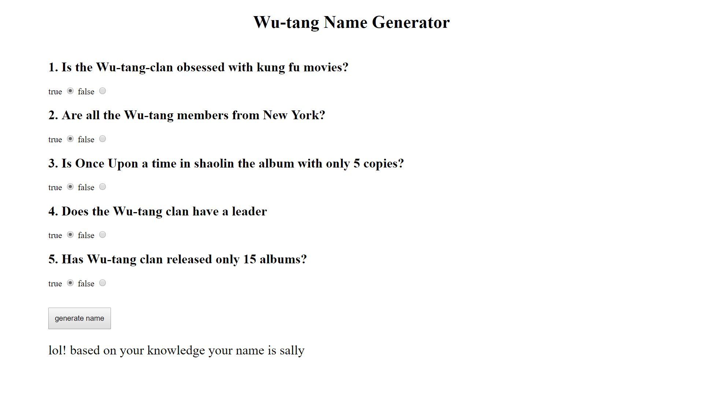

Wu-Tang Name Generator

This app allows the user to answer a couple of questions and generates a name based on the answers.

Demo:

How It's Made:
Tech used: HTML, CSS, Javascript,

I started off by gathering the names I wanted the program to generate. After that I created a conditional that generated a random name by use of the math.random method the names would be generated after an event listener was triggered.

Lessons Learned: I learned how to use conditionals to pull from an array of names but not only that it pulls a random name with the math.random method.
